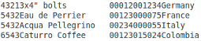
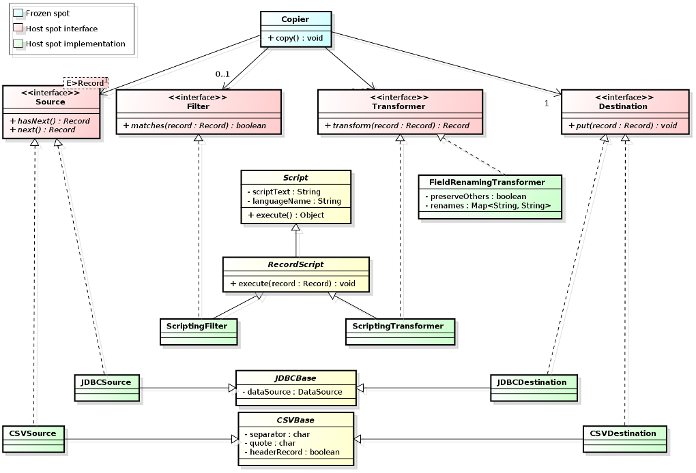

# Building Object Oriented Frameworks #
## 1. Introduction ##


[Object oriented frameworks](http://en.wikipedia.org/wiki/Software_framework)
are a mainstay of modern software development. Whether you develop in Java, C#,
Objective-C, Python, Ruby or Javascript, chances are you're basing your
development on some sort of application development framework.

Yet, not many of us are familiar with *building* application frameworks to fulfill
business needs in our organizations. This series of posts illustrates object
oriented framework development around a simple (though not trivial) application
domain.

This posts outlines what a framework is, how it is implemented and how it can
be used to build concrete applications. Future posts will zoom into the details
of framework design, usability and extensibility.

> The code for these documents, written in the [Xtend](http://www.eclipse.org/xtend/)
> programming language, is available at https://github.com/xrrocha/xrecords.
> Xtend is a modern JVM language whose syntax is highly readable to developers
> acquainted with the various mainstream object oriented languages.

## What is a framework anyway? ##

At is essence, a framework is a foundation for developing a particular type of
application.

A framework captures the expertise needed to solve a particular class of
problems. In doing so, it provides pre-written code that you can add to in
order to build a concrete application.

This concept is beautifully illustrated by Apple's OSX documentation in
the following allegory:


Unlike an application, a framework is not directly executable. This is so
because, for its given application domain, a framework captures what doesn't
change and deliberately leaves out what *can* change. You, the application
developer, must provide the bits that change for the framework to become an
executable application.

Because of this frameworks exhibit a property dubbed
[inversion of control](http://martinfowler.com/bliki/InversionOfControl.html),
where it is the framework that calls into your code, not the other way around.

## What a framework is not ##

As follows from the above, a framework is *not* a library. When you make use
of a library *you* decide when and how to call it. In a framework setup, though,
the framework is in control; you supply it with your code for it to execute at a
time of *its* choosing.

As it's often the case in software development, the term *framework* is
somewhat overloaded and is sometimes used with too narrow a meaning. Among web
developers, in particular, "framework" has become synonymous with "web
application development framework" or "model-view-controller framework".
While these development tools are indeed frameworks, the notion of 
framework as the foundation for a class of applications is much more general.


## Too abstract! Show me an example ##

Sure! Mind you, though, frameworks *are* abstract


Consider a utility to convert between tabular record formats such as:

- Relational database tables
- CSV and delimited files
- Fixed-length files
- XBase (DBF) files
- Flat JSON, XML or Yaml files

This utility uses [Yaml](http://en.wikipedia.org/wiki/YAML) as its configuration
format. Thus, for example, the following Yaml script populates a database table
from a CSV file:
 
```yaml
source: !csvSource
    input: !fromLocation [data/acme-form4269.csv]
    fields: &myFields [
        { name: tariff, format: !integer },
        { name: desc,   format: !string  },
        { name: qty,    format: !integer },
        { name: price,  format: !double ['#,###.##'] },
        { name: origin, format: !string },
        { name: eta,    format: !date [dd/MM/yyyy] }
    ]

filter: !condition [tariff != 0] # javascript

destination: !databaseDestination
    tableName:  form4269
    columns: *myFields # CSV field names match column names
    dataSource: !!org.postgresql.ds.PGSimpleDataSource
        user: load
        password: load123
        serverName: customs.feudalia.gov
        databaseName: forms
```

> The Yaml parser used here is [SnakeYAML](https://code.google.com/p/snakeyaml/).
> Type tags are based on [YamlTag](https://github.com/xrrocha/yamltag) 

### What's our application domain? ###

Every framework addresses a particular *application domain* for which it
supports building concrete applications.

Our utility's application domain is that of *tabular file format conversion*:
it transcribes data from one tabular file format to another.

<table border="0">
  <tr>
    <th>From: CSV</th>
    <th>To: Fixed-length</th>
  </tr>
  <tr>
    <td></td>
    <td></td>
  </tr>
</table>

We use the term *tabular* to state our records are flat in nature: we support
scalar fields only, with no provisions for arrays or nested records.

Incidentally, we treat relational database tables as just another format, on par
with its flat file cousins.

### What's the domain theory? ###

A framework embodies a theory about its problem domain. This is always the case,
even when the theory is implied only by the implementation.

Because frameworks strive to provide the foundation for *any* application
within their stated domain, their theories need to be comprehensive.

A comprehensive theory about an application domain can only stem from repeated
experiences in automating the domain. This is referred to as the
[Three Examples](http://st-www.cs.illinois.edu/users/droberts/evolve.html#ThreeExamples)
pattern of framework development.

Our tabular format conversion domain is simple enough to have a small theory.
Within this domain the notion of *concrete application* corresponds to a
program or script performing a specific conversion. In regard to the 3 examples
rule, this framework is backed by numerous hand-written, ad-hoc conversions. 

#### *Lingua Franca* ####

Translating among many formats calls for an *intermediate representation* to be
chosen such that all formats have translations to and from the intermediate
representation rather than translations to every other format.

This reduces the number of translations  from <code>n<sup>2</sup> - n</code> to
a more manageable <code>2n</code>. In absence of such *lingua franca*, we'd be
in a Babel Tower predicament.


A suitable intermediate representation for tabular records is the
format-agnostic, in-memory map whose keys are field names and whose values are
field contents:

```xtend
class Record {
    val fields = new HashMap<String, Object>()
    . . .
}
```

#### General Theory ####

- Every conversion has a *source* and a *destination*.
- The `Source` reads zero or more records encoded in the input tabular format.
  As each record is read, it is converted to a `Record` representation.
- The `Destination` accepts zero or more `Record`s. As each record is
  accepted, it is converted to the output tabular format and subsequently
  written.
- As each record is read it can be *filtered* to determine whether it should be
  included in the output or not. The optional component responsible for this
  selection is referred to as the `Filter`. 
- Finally, selected records can be *transformed* so as to conform with the
  requirements of the given `Destination`. The optional component
  responsible for this is referred to as the `Transformer`.

## The Framework Model ##

The above theory is captured in the following class diagram:


> NOTE: Even though we intend to copy only `Record`s, the copier framework as
> such need not be concerned with the concrete type of its data. Thus,
> it copies data items with a generic type (`E`) rather limiting itself to
> `Record`. This exemplifies another framework tenet:
> *[separation of concerns](http://en.wikipedia.org/wiki/Separation_of_concerns)* 

We had previously stated that a framework captures what doesn't change in its
domain. In our case, what doesn't change is the general algorithm followed to
copy records from a source to a destination:

```xtend
// Copier.xtend
source.open()
destination.open()

source.forEach [ in |
  if (filter.matches(in)) {
    val out = transformer.transform(in)
    destination.put(out)
  }
]

source.close()
destination.close()
```

Because this logic doesn't ever change it is referred to as a *frozen spot*.

The portions of the aplication that *can* change are called, correspondingly,
*hot spots*. In our framework they are:

- `Source`. Responsible for reading data items and translating them to the
  intermediate representation
- `Destination`. Responsible for translating from the intermediate
  representation to the output format and writing the result
- `Filter`. Responsible for determining whether a given instance of the
   intermediate representation should be further processed
- `Transformer`. Responsible for converting an intermediate representation
  instance provided by the `Source` to one suitable for the `Destination` 

The following class diagram depicts the framework implementation for the
database (JDBC) and CSV tabular formats:



Note how, despite their seemingly opposite natures, `Source` and `Destination`
share a common superclass for each tabular format.

Thus, for example, `CSVSource` (which reads comma-separated files) and
`CSVDestination` (which writes comma-separated files) share common attributes
such the separator character, the field-enclosing quote character and whether
the file has a header record or not.

Likewise, the database components `JDBCSource` and `JDBCDestination` share
a SQL `DataSource` attribute.

> Note that both `Filter` and `Transformer` above have *scripting* (rather
> than framework-supplied) implementations.
> This reflects the fact that  logic for record selection and modification is
> application-specific and, thus, hard to capture in a general,
> reusable way. Scripting provides a mechanism for developers to pass
> simple filtering and transformation expressions without having to
> write framework-aware code.
> The `FieldRenamingTransformer` component, on the other hand, satisfies the
> commonly occurring need to map input field names to different output field names. 

## Framework Instantiation ##

The process of extending the framework to turn it into an executable application
is called *framework instantiation*.

Instantiation for most frameworks require developers to write code extending
framework-provided classes and interfaces. Such frameworks are referred to
as *whitebox frameworks* because their internal structure (in terms of classes
and interfaces) is visible to application developers.

Other frameworks (ours included!) provide a repertoire of ready-made components
such that framework instantiation no longer requires application code but
only framework component *configuration*. Such frameworks are referred to as
*blackbox frameworks* because their internal implementation is opaque to
application developers who are only concerned configuring component
instances.

Blackbox frameworks make it possible to write new applications by wiring
pre-existing components like thus: 

```yaml
source: !databaseSource
     # Column labels are used as field names
    sqlText: |
        SELECT *
        FROM   emp
        ORDER BY deptno, empno
    dataSource: !!org.hsqldb.jdbc.JDBCDataSource
        url:    jdbc:hsqldb:file:hsqldb/example;hsqldb;shutdown=true
        user:   sa

filter: !scriptFilter [sal > 1000] # javascript

transformer: !renameFields # Only named fields are included in output record
    - empno: id
    - ename: name
    - sal: salary

destination: !xbaseDestination
    output:  !outputDestination [data/well-paid-emps.dbf]
    fields: [
        { id, format: !integer },
        { ename, format: !string },
        { sal, format: !double },
    ]
```

For our framework instantiation we've chosen Yaml to enunciate the application's
object graph. For scripting we default to Javascript.

In addition to Yaml, other forms in blackbox framework instantiation are
used.

In the Java world, in particular, the ever-popular
[Spring IoC container](http://docs.spring.io/spring/docs/current/spring-framework-reference/html/beans.html)
is frequently used as means of expressing framework instantiation. See
[the Heritrix settings](https://webarchive.jira.com/wiki/display/Heritrix/Basic+Crawl+Job+Settings)
guide for an example of Spring IoC framework configuration. 

Of course, good ole' source code can be used to enact framework instantiation:

```xtend
val copier = new Copier => [
    source = new JDBCRecordSource => [
        sqlText = "SELECT * FROM emp ORDER BY deptno, empno"
        dataSource = new JDBCDataSource => [
            user = "sa"
            url = "jdbc:hsqldb:file:hsqldb/example;hsqldb;shutdown=true"
        ]
    ]
    
    filter = new ScriptingCopierComponent => [
        script = "sal > 1000"
    ]
    
    transformer = new FieldRenamingTransformer => [
        renames = #{
            "empno" -> "id",
            "ename" -> "name",
            "sal"   -> "salary"
        }
    ]
    
    destination = new XBaseRecordDestination => [
        output = new FileLocationOutputStreamProvider => [
            location = "data/well-paid-emps.dbf"
        ]
        fields = #[
            new FormattedField<Integer> => [ parser = new IntegerParser ],
            new FormattedField<String> => [ parser = new StringParser ],
            new FormattedField<Double> => [ parser = new DoubleParser ]
        ]
    ]  
]
```

## Conclusion ##

The essence of framework design lies in capturing the application logic that
doesn't change. Such immutable logic (or *frozen spot*) expresses the business
behavior in terms of one or more abstract components (or *hot spots*) that
model what does change from application to application.

For each hot spot multiple, alternative implementations may exist. Framework
instantiation generally involves selecting what specific hot spot implementations
to use as dictated by the application's requirements.

As we'll see later on, each concrete hot spot implementation can be itself
modeled as a framework. This recursive design process pervades framework
design and implementation.

Ideally, frameworks evolve towards a *blackbox* style where new applications can
be created with little or no programming. Instead, new applications are built
by mixing, matching, wiring and configuring pre-existing components.

This is the approach illustrated by our tabular format conversion utility. By
capturing all the moving parts in its domain, this framework can be fully
instantiated as an object graph wiring together existing components to assemble
a fully working application capable of performing a specific format-to-format
conversion.


