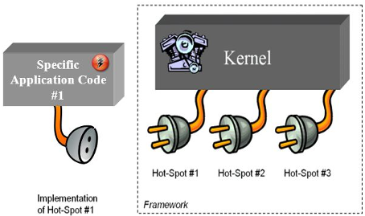
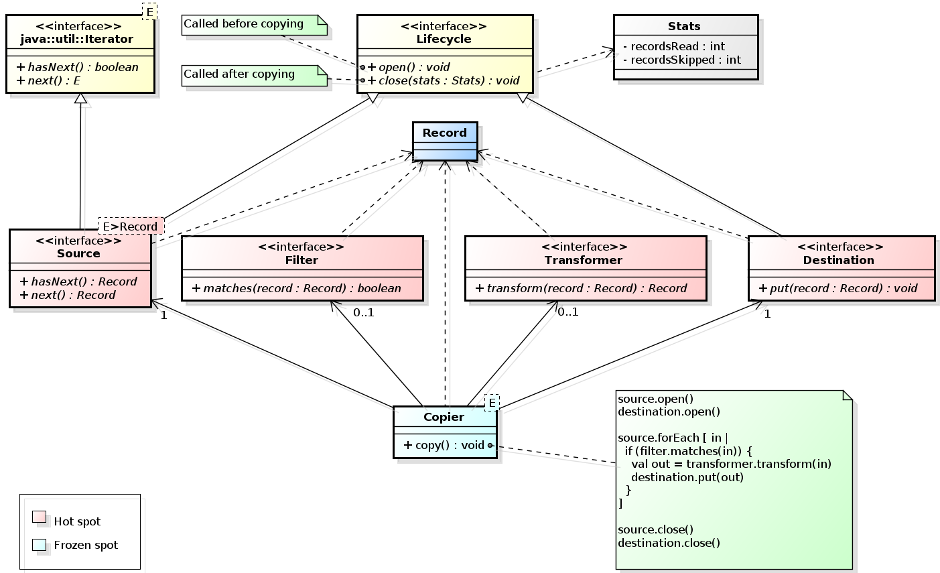

# Building Object Oriented Frameworks #

<sub>

[Object oriented frameworks](http://en.wikipedia.org/wiki/Software_framework)
are a mainstay of modern software development. Whether you develop in Java, C#,
Objective-C, Python, Ruby or Javascript, chances are you're basing your
development on some sort of application development framework.
Yet, not many of us are familiar with *building* application frameworks to
fulfill business needs in our organizations. This series of posts illustrates 
object oriented framework development around a simple (though not trivial)
application domain. The code for these documents, written in the [Xtend](http://www.eclipse.org/xtend/)
programming language, is available at https://github.com/xrrocha/xrecords.
Xtend is a modern JVM language whose syntax is highly readable to developers
acquainted with the various mainstream object oriented languages.
</sub>

1. In our [first post](http://blog.xrrocha.net/2014/08/building-object-oriented-frameworks-1.html)
   we outlined what a framework is, how it is implemented and how it can be used
   to build concrete applications. 
2. In this second post we zoom into the details of framework design around the
   [xrecords](https://github.com/xrrocha/xrecords) example. We identify the
   portions of the application domain that do not change from application to
   application and capture them as framework *frozen spots*. In doing so, we
   also identify the portions that do change between applications and capture
   them as abstract interfaces to be concretized by application developers: the
   *hot spots*.

## 2. Frozen Spots, Hot Spots ##

For any given application domain, a framework separates what is fixed from
what is variable.

The intent is to capture, once and for all, the application aspects that are
fixed so that future applications do not have to repeat them over and over.
Because such application aspects are captured into the framework kernel in an
unchanging form, they're referred to as *frozen spots*.

Application aspects that can change from application to application, on the 
other hand, are referred to as *hot spots*.

Obviously, hot spot actual functionality cannot be captured by the
framework beforehand, but its relationship with the frozen spots *can*: hot
spots are seen by the framework as interfaces (or abstract classes) for which
an open-ended number of pluggable implementations may exist.



> An important consequence of this architecture is that framework
> customization occurs mostly by supplying concrete hot spot 
> implementations, seldom -if ever-  by altering the framework kernel's
> source code!

## `xrecord` Frozen Spot ##

Our example record copying framework exhibits one obvious frozen spot: that of
reading records from an input source, possibly filtering and transforming them, 
and then writing them to their output destination:



A first-draft implementation for the above may look like:

```xtend
// The framework data
class Record extends HashMap<String, Object> {} // Simplified, for now

// A framework-defined contract: setting up and wrapping up
interface Lifecycle {
    def void open()
    def void close()
}

// Hot spot: interface for record producer
interface Source extends Iterator<Record>, Lifecycle {}

// Hot spot: interface for record consumer
interface Destination extends Lifecycle { def void put(Record record) }

// Hot spot: interface for record filtering
interface Filter {
    def boolean matches(Record record)
    val nullFilter = new Filter { override matches(Record record) { true } }
}

// Hot spot: interface for record transformation
interface Transformer {
    def Record transform(Record record)
    val nullTransformer = new Transformer { override transform(Record record) { record } } 
}

// Framework frozen spot (hence a concrete, possibly final, class)
class Copier {
    @Accessors Source source
    @Accessors Filter filter =  Filter.nullFilter
    @Accessors Transformer transformer = Transformer.nullTransformer
    @Accessors Destination destination
    
    def copy() {
        source.open()
        destination.open()
        
        source.forEach [ inputRecord |
            if (filter.matches(inputRecord)) {
                val outputRecord = transformer.transform(inputRecord)
                destination.put(outputRecord)
            }
        ]
        
        destination.close()
        source.close()
    }
}
```

## `xrecord` Hot Spots ##

As seen above, our framework leaves four components unimplemented for developers to supply. When concrete instances of these hot spots are supplied
to our framework, it is *instantiated* into a running application:

- `Source`: an iterator returning `Record`s
- `Filter`: an optional sieve to select only applicable records
- `Transformer`: an optional modifier to refine selected records
- `Destination`: a sink where to put resulting records

> Note how our framework supplies ready-made, no-op implementations for
> `Filter` and `Transformer` (`nullFilter` and `nullTransformer` respectively). This reflects the fact that such steps
> are *optional* as many applications just need to convert between
> formats without further elaboration.

Since `Source` extends `Iterator` we can use Xtend's powerful `forEach`
lambda construct to traverse it:

```xtend
source.forEach [ inputRecord |
    if (filter.matches(inputRecord)) {
        val outputRecord = transformer.transform(inputRecord)
        destination.put(outputRecord)
    }
]
```

Both `Source` and `Destination` extend the `Lifecycle` contract and thus
must provide implementations for the `open()` and `close()` operations. This
makes sense as record sources typically need to perform houskeeping actions
such as:

- opening and closing files
- connecting and disconnecting from databases
- connecting and disconnecting from remote FTP servers

## Time for an Example ##

Let's see how we can turn our framework into an executable application by
adding simple implementations for these hot spots.

Consider the case where need to process a mainframe-supplied, fixed-length
record containing the following fields:

|Field|Offset|Length|
|-----|------|------|
|code|0|3|
|desc|3|24|
|qty|27|4|
|price|31|6|

where `price` has 2 (implicit) decimal positions. This file would look like:

```
123Bolts x 10               0012000245
234Eau de Perrier           2000000075
345Acqua Pellegrino         0520000055
456Caturro Coffee           0032015024
```

and we want to produce a spreadsheet-friendly, CSV file for totals above $1,000.
The resulting file would look like:

```
"Code","Desc","Total"
123,"Bolts x 10",2940
234,"Eau de Perrier",1500
456,"Caturro Coffee",4807.68
```

The following is a (somewhat verbose) approximation to the application code:

```xtend
class MyXRecordsApplication {
  static def main(String[] args) {
    val copier = new Copier => [
        // Hot spot implementation: Source
        source = new Source {
            var String line
            var BufferedReader in
            
            override open() {
               in = new BufferedReader(new FileReader('examples/mainframe-file.dat'))
            }
            override hasNext() {
              line = in.readLine()
              line != null
            }
            override Record next() {
              val record = new Record
              record.put('code', line.substring(0, 3))
              record.put('desc', line.substring(3, 27))
              record.put('qty', Integer.parseInt(line.substring(27, 31)))
              record.put('price', Double.parseDouble(line.substring(31, 37)) / 100)
              record
            }
            override close() {
                in.close()
            }
            override remove() {}
       }
       // Hot spot implementation: Filter
       filter = new Filter {
           override matches(Record record) {
             val qty = record.get('qty') as Integer
             val price = record.get('price') as Double
             qty * price > 1000
           }
       }
       // Hot spot implementation: Transformer
       transformer = new Transformer {
           override transform(Record record) {
             val qty = record.get('qty') as Integer
             val price = record.get('price') as Double
             record.put('total', qty * price)
             record
           }
       }
       // Hot spot implementation: Destination
       destination = new Destination {
           var PrintWriter out
           
           override open() {
               out = new PrintWriter(new FileWriter('examples/spreadsheet-file.csv'), true)
               out.println('"Code","Desc","Total"')
           }
           override put(Record record) {
               val line = #['code', 'desc', 'total'].
                   map['''"«record.get(it).toString.trim»"'''].
                   join(',')
               out.println(line)
           }
           override close() {
               out.close()
           }
       } 
    ]
    
    copier.copy()
  }
}
```

## Cool! A bit involved, though... ##

Yes, a bit... 

This is so because (so far) our framework only captures the essence of record
copying. Our hot spot implementations are still burdened with ancillary
responsibilities such as:

- Formatting fields
- Decoding input lines into records
- Assembling output lines from records

We can do better.

In the next post we'll see how to augment the framework with new frozen spots
dealing with these aspects. We'll also write ready-made, *configurable* hot spot
implementations developers can reuse to minimize repetition and verbosity.

Stay tuned!


 


