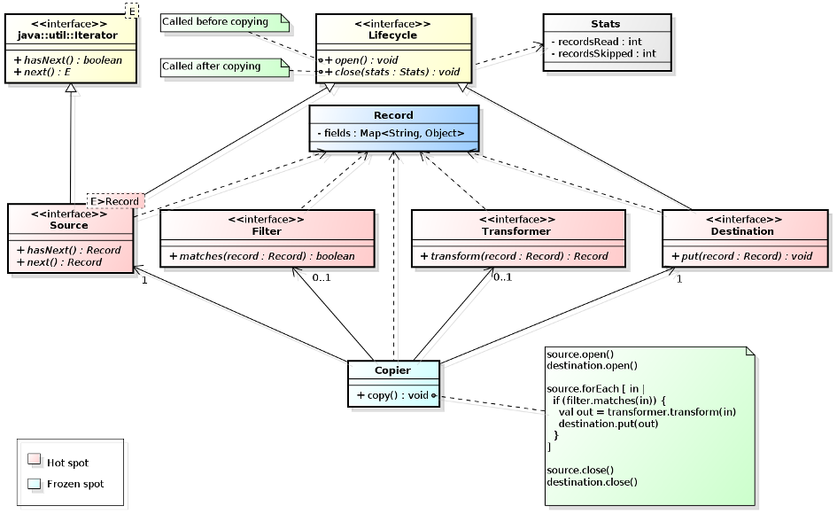

# Learning to Build Object Oriented Frameworks #


[Object oriented frameworks](http://en.wikipedia.org/wiki/Software_framework)
are a mainstay of modern software development. Whether you develop in Java, C#,
Objective-C, Python, Ruby or Javascript, chances are you're basing your
development on some sort of application development framework.

Yet, few of us are familiar with *building* application frameworks to fulfill
business needs in our organizations. This series of posts illustrates object
oriented framework development around a simple (though not trivial) application
domain.

> The code for these documents, written in the [Xtend](http://www.eclipse.org/xtend/)
> programming language, is available at https://github.com/xrrocha/xrecords.

## What is a framework anyway? ##

At is essence, a framework is a foundation for developing a particular type of
application.

A framework captures the expertise needed to solve a particular class of
problems. In doing so, it provides pre-written code that you can add to in
order to build a concrete application.

This concept is beautifully illustrated by Apple's OSX documentation in
the following allegory:


Unlike an application, a framework is not directly executable. This is so
because, for its given application domain, a framework captures what doesn't
change and deliberately leaves out what *can* change. You, the application
developer, must provide the bits that change for the framework to become an
executable application.

Because of this, developing with frameworks exhibits a property dubbed
*[inversion of control](http://martinfowler.com/bliki/InversionOfControl.html)*
where it is the framework that calls into your code, not the other way around.

## What a framework is not ##

As follows from the above, a framework is *not* a library. When you make use
of a library *you* decide when and how to call it. In a framework setup, though,
the framework is in control; you supply it with your code for it to execute at a
time of *its* choosing.

As it's often the case in software development, the term *framework* is
somewhat overloaded and is sometimes used with too narrow a meaning. Among web
developers, in particular, "framework" has become synonymous with "web
application development framework" or "model-view-controller framework".
While these development tools are indeed frameworks, the notion of 
framework as the foundation for a class of applications is much more general.


## Too abstract! Show me an example ##

Sure! Mind you, though: frameworks *are* abstract ;-)

Consider the case of a small country's government agency that decided to
allow patrons to submit some forms (and receive replies) as flat files instead
of paper documents. Incoming files are loaded into their relational database
and replies are extracted from the database in the patron's preferred file
format. Supported file formats include:

<table>
    <tr>
        <td>
            <ul>
                <li>CSV/delimited files</li>
                <li>Fixed-length files</li>
                <li>[Flat] XML files</li>
                <li>XBase (DBF) files</li>
            </ul>
        </td>
        <td>
            <table>
                <tr>
                    <td></td>
                </tr>
                <tr>
                    <td></td>
                </tr>
                <tr>
                    <td></td>
                </tr>
            </table>
        </td>
    </tr>
</table>

At first, only a few forms were supported so developers wrote script-like Java
programs to load and extract data in a form/format-specific fashion. As was to
be expected, other forms were soon included and the number of patrons opting for
"electronic form processing" grew. The count of repetitive load/extraction
programs went over a hundred. In some cases, programmers opted for writing
conversions from an unsupported file format to a supported one in order to
leverage existing load/extraction programs for a given form.

A call for help was made to simplify and unify this codebase.

### What's the *application domain* here? ###

On the surface, one could consider this application domain to be that of
"database loading and extraction" but closer analysis reveals we can actually
simplify things by addressing a more general space:
*tabular file format conversion*; the simpler act of rephrasing the same data
from one format to another.

We use the term "tabular" (rather than "flat") to emphasize that relational
database tables are just another format, on par with their flat file cousins.
Thus, when a flat file containing a filled form is received we view  it as a
conversion from the flat file's format to the database table format.
Correspondingly, when we extract the reply from the database to a flat file we
view it as a conversion from the database table format to the target flat file
format.

Added bonus: even though our business requirements didn't call for it, we should
be able to convert between non-database formats without extra effort! Thus,
for instance, we could convert a fixed-length file to CSV format in order to
move mainframe data to a spreadsheet. 

### What's the *theory*? ###

A framework always embodies a theory about its problem domain. This theory
demarcates the scope of the framework and dictates how it satisfies the
domain's business requirements.

A theory about an application domain can only be comprehensive when it stems
from repeated experiences in automating the domain. This is referred to as
the [Three Examples](http://st-www.cs.illinois.edu/users/droberts/evolve.html#ThreeExamples)
rule of framework development; it is impossible to develop a framework in
absence of such experience. As the document states, *no one is that smart*.

In our case, thankfully, we have over a hundred tabular file conversions to
draw from ;-)

The first realization in our tabular record conversion domain is that we need
a reference data format, a *lingua franca*. Otherwise, we'd be in the Babel
Tower predicament of having to implement `n*(n - 1)` format conversions!


Our chosen lingua franca is a neuter, in-memory representation of a tabular
record: a humble `Map<String, Object>` whose keys are field names and whose
values are field contents. We'll refer to this representation as `Record`.

Thus, all participating formats are required to provide conversions to and from
`Record`.

Given this common data representation we can now address the essence of our
format conversion framework.

- Each conversion has a *source* and a *destination*.
- A `Source` reads one or more data data items encoded in its input tabular
  format and converts each to the `Record` format.
- A `Destination`, in turn, accepts one or more `Record`s and converts each to
  its output tabular format.
- As each record is read it can be *filtered* to determine whether it should be
  included in the output. The optional component resposible for this is called
  a `Filter`. 
- Finally, selected records can be *transformed* so as to conform with the
  expectations of the given `Destination` (for instance, when copying between
  database tables, columns may need to be renamed). The optional component
  responsible for this is called a `Transformer`.

## The Framework Model ##

The above theory is captured in the following class diagram:



> NOTE: Even though we intend to copy only `Record`s, the copier framework as
> such need not be concerned with the actual type of its data. Because of this,
> it copies data items with a generic type (`E`) rather than being
> unnecessarily limited to `Record`. This exemplifies another framework design
> principle:
> *[separation of concerns](http://en.wikipedia.org/wiki/Separation_of_concerns)* 

We had previously stated that a framework captures what doesn't change in its
domain. In our case, what doesn't change is the general algorithm followed to
copy records from a source to a destination:

```java
// Copier.xtend
source.open()
destination.open()

source.forEach [ in |
  if (filter.matches(in)) {
    val out = transformer.transform(in)
    destination.put(out)
  }
]

source.close()
destination.close()
```

Because this logic doesn't ever change it's referred to as a *frozen spot*.

The portions of the aplication that *can* change are called, correspondingly,
*hot spots*. In our framework they are:

- `Source`. This interface has implementations for all supported formats
- `Destination`. This interface has implementations for all supported formats
- `Filter`. This interface has a scripting implementation
- `Transformer`. This interface has a scripting implementation

The following class diagram depicts the framework implementation for the
database (JDBC) and CSV tabular formats:


> Note that both `Filter` and `Transformer` have *scripting* (rather than
> framework-supplied) implementations.
> This reflects the fact that  logic for record selection and modification is
> application-specific and, thus, hard to capture in a general,
> reusable way. Scripting provides a mechanism for developers to pass
> simple filtering and transformation expressions without having to
> write framework-aware code.
> The `FieldRenamingTransformer` component, however, satisfies the commonly
> occurring need to map input field names to different output field names. 

## Framework Instantiation ##

The process of extending the framework to turn it into an executable application
is called *framework instantiation*.

Instantiation for most frameworks require developers to write code extending
framework-provided classes and interfaces. Such frameworks are referred to
as *whitebox frameworks* because their internal structure (in terms of classes
and interfaces) is visible to application developers.

Other frameworks (ours included!) provide a repertoire of ready-made components
such that framework instantiation no longer requires application code but
only framework component *configuration*. Such frameworks are referred to as
*blackbox frameworks* because their internal implementation is opaque to
application developers who are only concerned with component configuration.

For our framework instantiation we've chosen
[Yaml](http://en.wikipedia.org/wiki/Yaml) (in its
[SnakeYAML](https://code.google.com/p/snakeyaml/) incarnation) to enunciate
the application's object graph. For scripting we default to Javascript.

The following Yaml script populates a database table from a CSV file:

```yaml
source: !csvSource
    input: !inputLocation [data/form4269.csv]
    fields: &fields [
        { name: tariff, format: !integer },
        { name: desc,   format: !string  },
        { name: qty,    format: !integer  },
        { name: price,  format: !double ['#,###.##']  },
        { name: origin, format: !string  },
        { name: eta,    format: !date [dd/MM/yyyy]  }
    ]

filter: !scriptFilter [tariff != 0]

destination: !databaseDestination
    tableName:  form4269
    columns: *fields
    dataSource: !!org.postgresql.ds.PGSimpleDataSource
        user: load
        password: load123
        serverName: forms.customs.feudalia.gov
        databaseName: forms
```


